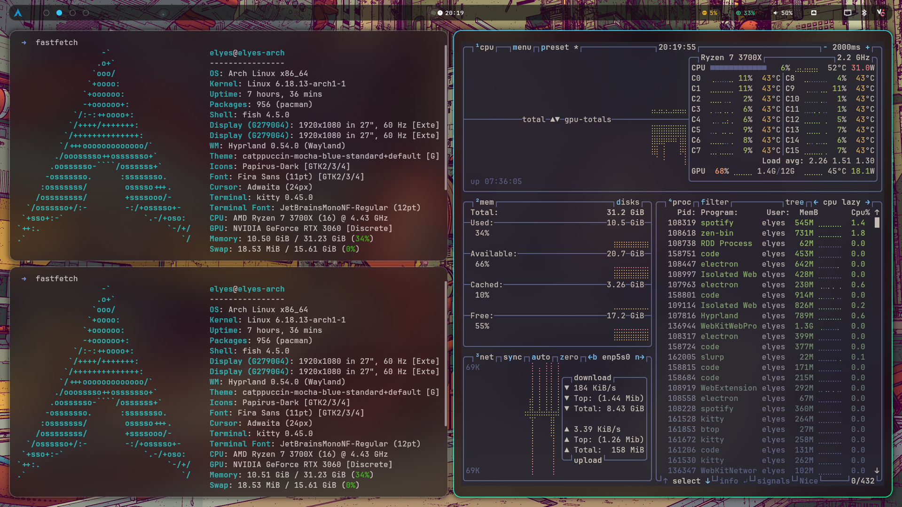

# ELYES' DOTFILES


Welcome to my personal configuration files. Optimized for a clean workflow on **Arch Linux** (Hyprland) and **WSL** (CLI focus).

## 

## 📂 Structure

- **`hypr/`**: Modern & smooth Wayland compositor config.
  - `conf/`: Modular configs for `binds.conf`, `decoration.conf`, `exec.conf`.
- **`fish/`**: Fully modular shell setup with auto-loading functions.
- **`starship/`**: Custom "Pill" theme with OS-detection & git status.
- **`vicinae/`**: Configs for the Vicinae launcher & clipboard.
- **`waybar/` & `dunst/`**: UI & Notification bars.

---

## Installation

## ⚠️ Disclaimer

> **Read before you run!** These dotfiles are tailored for my personal system. Some configurations contain hardcoded paths (e.g., monitor names like `DP-2` or specific home directory paths).

> Please **review the config files** and adjust the paths to match your hardware and directory structure before installing.

### On Arch Linux

1. Clone the repo: `git clone https://github.com/elyesghazel/dotfiles.git ~/dotfiles`
2. Run the installer:
   ```bash
   cd ~/dotfiles
   chmod +x install.sh
   ./install.sh
   ```

### On WSL (Windows Subsystem for Linux)

1. Clone the repo: `git clone https://github.com/elyesghazel/dotfiles.git ~/dotfiles`
2. Run the WSL installer:

```bash
cd ~/dotfiles
chmod +x wsl-install.sh
./wsl-install.sh

```

---

## ⌨️ Keybinds (Highlights)

| Keybind             | Action                      |
| ------------------- | --------------------------- |
| `SUPER + RETURN`    | Open Kitty Terminal         |
| `ALT + SPACE`       | Toggle Vicinae Menu         |
| `SUPER + S`         | Screenshot (Clipboard)      |
| `SUPER + SHIFT + S` | Screenshot (Area selection) |
| `SUPER + ALT + W`   | Randomize Wallpaper         |
| `SUPER + B`         | Launch Zen Browser          |
| `SUPER + V`         | Clipboard History           |

---

## Management Tools

- **`dotsync`**: Custom fish function. Automatically updates package lists (`pacman_pkgs.txt` & `aur_pkgs.txt`) and pushes all changes to GitHub.
- **`hconf`**: Quick-edit Hyprland configs. Use `hconf binds` to jump straight into keybinds.
- `npr` / `npu`: Quick project & GitHub repo creator.

---

## 🎨 Themes & Fonts

- **Font**: [JetBrainsMono Nerd Font](https://github.com/ryanoasis/nerd-fonts)
- **Bar**: Waybar (Custom Pill Style)
- **Notifications**: Dunst (with Papirus Icons)
- **Colors**: Custom Blue/Mocha palette

---

_Maintained with ❤️ by Elyes_
