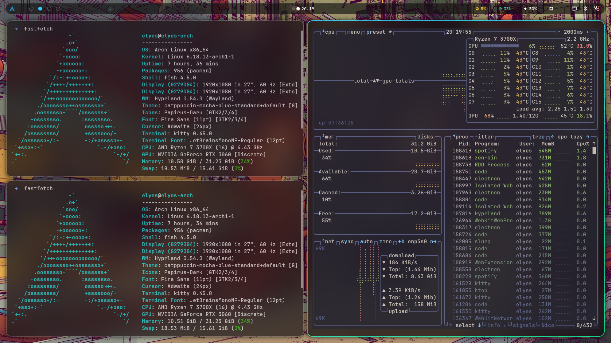

# ELYES' DOTFILES




Personal configuration files for Arch Linux (Hyprland) and WSL (CLI).

---

## Structure

```
dotfiles/
├── RUNNING.md          inventory of services/timers/autostart on this machine
├── packages/
│   ├── pacman.txt      official Arch packages
│   ├── aur.txt         AUR packages
│   └── update.sh       export / list / diff packages, dump services
├── fish/               shell — functions, completions, conf.d
├── hypr/               Hyprland WM (Lua config, modular conf/)
├── waybar/             status bar
├── dunst/              notification daemon
├── kitty/              terminal emulator
├── starship/           shell prompt
├── vicinae/            launcher & clipboard
├── spicetify/          Spotify theming
├── claude/             Claude Code — global CLAUDE.md, settings, skills, MCP bootstrap
└── gopro/              GoPro → Jellyfin streaming pipeline (NVENC transcode + scripts)
```

See [`gopro/README.md`](gopro/README.md) for the full GoPro → Jellyfin workflow.

---

## Claude Code

`stow claude` links the whole global config into `~/.claude/`:

| Path | Sync | What |
|------|------|------|
| `CLAUDE.md` | symlink | Global instructions — commit conventions, skill triggers |
| `skills/` | symlink | 8 skills: drawio, ui-ux-pro-max, graphify, sdx-design, excalidraw-boards, markitdown, content-strategy, mega-goal-prompt |
| `bin/mcp-bootstrap.fish` | symlink | Recreates user-scope MCP servers |
| `settings.json` | **copy** | Model, effort, theme, statusline, plugins, marketplaces |

`settings.json` is deliberately **not** symlinked — Claude Code rewrites it atomically
(write temp + `rename`), which silently replaces a symlink with a regular file and severs it
from the repo. `claude/.stow-local-ignore` keeps stow off it; `install.sh` copies repo →
home, and `dotsync` copies home → repo before committing.

**MCP servers are not synced as a file.** They live in `~/.claude.json`, which also holds
OAuth tokens, `userID`, `machineID` and per-project history — so that file is gitignored.
The server *definitions* are tracked in `bin/mcp-bootstrap.fish` and the *secrets* are not:

```bash
cp ~/.claude/secrets.fish.example ~/.claude/secrets.fish   # gitignored
$EDITOR ~/.claude/secrets.fish                             # fill in real values
fish ~/.claude/bin/mcp-bootstrap.fish                      # idempotent
```

`install.sh` runs that last step automatically once `secrets.fish` exists.

Also never synced: `.credentials.json`, `settings.local.json` (machine-local permission
grants), and all session/history state. See [`claude/.gitignore`](claude/.gitignore).

> If a symlinked config ever turns back into a regular file, run `stow -R claude`.

---

## Commit conventions

[Conventional Commits](https://www.conventionalcommits.org/), subject line only:

```
feat(pi-context): add capability modes
fix(theme): correct dark-mode token fallback
chore(deps): bump stow to 2.4.1
```

No body unless it explains a *why* the diff cannot show. `dotsync "fix(waybar): ..."`
validates the format; bare `dotsync` falls back to `chore(sync): ...`. Full rules live in
[`claude/.claude/CLAUDE.md`](claude/.claude/CLAUDE.md), which Claude Code loads globally.

---

## Installation

> **Note:** Review configs before running — some paths (monitor names, home dirs) are hardcoded for my machine.

```bash
git clone https://github.com/elyesghazel/dotfiles.git ~/dotfiles
cd ~/dotfiles
chmod +x install.sh
./install.sh
```

This installs all packages from `packages/pacman.txt` and `packages/aur.txt`, then links configs via `stow`.

---

## Package Management

```bash
packages/update.sh update   # export installed packages → lists
packages/update.sh list     # show all packages in the lists
packages/update.sh diff     # compare system vs lists
```

---

## Keybinds

| Keybind             | Action                      |
| ------------------- | --------------------------- |
| `SUPER + RETURN`    | Open Kitty terminal         |
| `SUPER + TAB`       | Hyprview (smartgrid)        |
| `ALT + SPACE`       | Vicinae launcher            |
| `SUPER + S`         | Screenshot → clipboard      |
| `SUPER + SHIFT + S` | Screenshot (area selection) |
| `SUPER + ALT + W`   | Randomize wallpaper         |
| `SUPER + B`         | Zen Browser                 |
| `SUPER + V`         | Clipboard history           |
| `SUPER + L`         | Lock screen                 |

---

## Fish Functions

| Command    | Description                                      |
| ---------- | ------------------------------------------------ |
| `dotsync`  | Update package lists and push everything to git  |
| `hconf`    | Quick-edit Hyprland config files                 |
| `npr`      | Create a new local project                       |
| `npu`      | Create a new GitHub repo                         |
| `update_all` | Update pacman + AUR + other tools              |

---

## Theme

- **Font**: JetBrainsMono Nerd Font
- **Colors**: Catppuccin Mocha
- **Bar**: Waybar (pill style)
- **Notifications**: Dunst

---

_Maintained by Elyes_
